# STA — Sistema de Transferência de Arquivos

<div align="center">


</div>

<p align="center">
<b>Enterprise File Transfer Service</b><br>
Windows Service • .NET 10 • PostgreSQL • Clean Architecture
</p>

<p align="center">
  
</p>

<p align="center">
Serviço Windows para automatizar a transferência de arquivos entre servidores, com janela de execução configurável, fan-out multi-destino, compactação 7-Zip e registro detalhado de logs por arquivo.
</p>

---

## ✨ Recursos

* Transferência automática de arquivos entre servidores
* Janela de execução configurável
* Fan-out para múltiplos destinos
* Compactação utilizando 7-Zip
* Registro detalhado por arquivo
* Retry automático para falhas
* Arquitetura em camadas (Clean Architecture)
* Cobertura completa de testes automatizados
* API REST em desenvolvimento (Fase 6)

---

## 🚀 Subindo o ambiente

```bash
# 1. Banco de dados
docker compose up -d postgres

# 2. Criar as tabelas
cd src/STA.Worker
dotnet ef database update

# 3. Executar o Worker
dotnet run

# 4. Executar os testes
dotnet test STA.sln
```

> **Ambientes**
>
> * **Desenvolvimento:** utiliza `appsettings.Development.json` (arquivo ignorado pelo Git).
> * **Produção:** utiliza variáveis de ambiente (`STA_DB_CONN`, etc.).

---

## 📁 Estrutura do projeto

```text
src/
├── STA.Core/            # Domínio, entidades, contratos e regras de negócio
├── STA.Worker/          # Serviço Windows, Program.cs e migrations
├── STA.Api/             # API REST (Fase 6)
│
tests/
└── STA.Tests/           # Testes unitários e integração
│
docker-compose.yml       # PostgreSQL para desenvolvimento
STA.sln                  # Solução principal
```

---

## 🏗️ Arquitetura

O projeto segue os princípios de **Clean Architecture**, separando responsabilidades em camadas independentes para facilitar manutenção, testes e evolução.

```text
               REST API (Fase 6)
                      │
                      ▼
               Application Layer
                      │
                      ▼
                 Domain Layer
                      │
                      ▼
             Infrastructure Layer
                      │
                      ▼
      PostgreSQL • File System • 7-Zip
```

---

## 💡 Sobre o projeto

Este projeto representa a modernização de um serviço legado originalmente desenvolvido em **VB.NET Framework 2.0**, migrado para **.NET 10** utilizando uma estratégia de refatoração incremental orientada por testes.

O objetivo foi preservar o comportamento da aplicação durante toda a migração, evoluindo gradualmente a arquitetura, aumentando a cobertura de testes e preparando a solução para futuras funcionalidades, como a API REST e o dashboard de monitoramento.

---

## 📈 Roadmap

* ✅ Migração para .NET 10
* ✅ Cobertura de testes
* ✅ PostgreSQL
* ✅ Worker Service
* ✅ Logging estruturado
* 🚧 API REST
* ⏳ Dashboard Web
* ⏳ Monitoramento em tempo real

---

## 📜 Licença

Projeto privado desenvolvido para fins de estudo, modernização de software legado e demonstração técnica.
